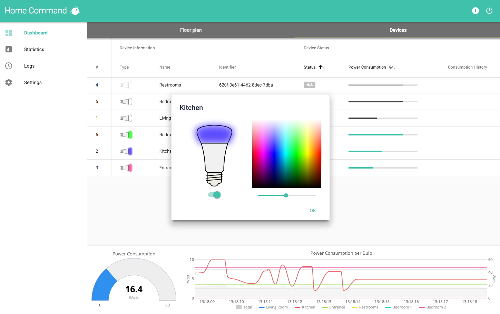

# Home Command (Vaadin Elements Demo Application)


[![Join the chat at https://gitter.im/jtreml/home-command][gitter-image]][gitter-link] [![Stories in Ready][waffle-image]][waffle-link]

[gitter-image]: https://badges.gitter.im/Join%20Chat.svg
[gitter-link]: https://gitter.im/jtreml/home-command?utm_source=badge&utm_medium=badge&utm_campaign=pr-badge&utm_content=badge
[waffle-image]: https://badge.waffle.io/jtreml/home-command.svg?label=ready&title=Ready
[waffle-link]: http://waffle.io/jtreml/home-command

[Try it out](#try) &bullet; [Disclaimer](#disclaimer) &bullet; [Credits](#credits)


This is a simple demo application meant to show how to build a IoT-oriented web application with Web Components (specifically [Google Polymer][polymer]), using [Vaadin Elements][elements] for powerful grid and charts UI components.

The application connects to a brigde for the [Philips Hue][hue] lighting system, shows the status of connected light bulbs and let's the user control the lights. In short, what you get is:

- Custom light bulb component to visualize current state
- Very visual grid making use of renderers, custom, Polymer and Vaadin components
- Highly interative control component to switch lights on and off, control color and brightness
- Live-updating charts to visualize current power consumption
- Drum machine to make the lights go with the beat



[polymer]: https://www.polymer-project.org/1.0/
[elements]: https://vaadin.com/elements
[hue]: http://www.meethue.com/


<h2 id="try">Try it out</h2>

**Please note: The application currently only works in Chrome due to ECMAScript 6 and [this color picker](https://github.com/bbrewer97202/color-picker-element/) being used.**

<h3 id="short">Short version</h3>

Download tools and dependencies and run the application

```sh
cd home-command && npm install && bower install
gulp serve
```

**Option A: Use real Hue system**

1. First time only: Press the button on your Hue bridge
2. Click refresh in your browser to make the application reload and connect to bridge.

**Option B: Use simulated lights**

1. Open `app/elements/elements.html`
2. Comment the real service and uncomment the fake service.

```html
<!-- <link rel="import" href="hue/hue-device-service.html"> -->
<link rel="import" href="hue/hue-device-service-fake.html">
```


<h3 id="long">Long version</h3>

#### Tools

The projects relies on Node.js, gulp and bower for build and dependency management.

1. If you don't have Node.js installed, or you have an older version, go to [nodejs.org](https://nodejs.org) and click on the big green Install button.
2. Install `gulp` and `bower`

```sh
npm install -g gulp bower
```

#### Dependencies

Any further tools and dependcies needed can automatically be installed using the above tools. Just run the following:

```sh
cd home-command && npm install && bower install
```

#### Hardware

The best way to try this application is of course with real Hue light bulbs. For this to work, you need to be on the same network as your Hue bridge.

The application will search for new bridges and try to connect to them everytime you reload the page (i.e. click refresh in your browser). The first time you try to connect to a new bridge, you need to press the the central button on your Hue bridge and then reload the application. This allows the application to create a user account for your bridge which will then be stored in local storage and used for future connections. So this is only necessary the first time you want to connect to a new bridge. After that, everytime you reload the page, the application will read the existing user credentials from local storage and use those to reconnect to the bridge.

If you don't have real Hue lights available, then you can make use of the _fake_ service that comes with the application to simulate virtual light bulbs. Just open the `app/elements/elements.html` file and comment or delete the import for the real Hue device service and the uncomment the import for the fake device service towards the end of the file. The final version should look like this:

```html
<!-- <link rel="import" href="hue/hue-device-service.html"> -->
<link rel="import" href="hue/hue-device-service-fake.html">
```

#### Launch

Launch a web server to try the application:

```sh
gulp serve
```

Then head to [http://localhost:5000/](http://localhost:5000/) to try it out.


<h2 id="disclaimer">Disclaimer</h2>

This is a demo done for educational purposes, both to learn new concepts myself as well as to showcase some of those as part of my professional tasks at my current employer. As a result, this project is neither complete nor fool proof nor functional or reliable in all its parts. It is not meant as a template of best practices and some parts will have more rough edges than others. Please keep that in mind. Also, it is still work in progress.

Nevertheless, if you find issues or better solutions for certain aspects, feel free to report them or send pull requests.


<h2 id="credits">Credits</h2>

- Lights _dancing to the beat_ is built with a modified version of Teemu Pöntelin's awesome "[Drum Machina][drum]" demo.
- Dial icon by [useiconic.com via Noun Project][dial-icon]
- [paper-color-picker][color-picker] by David Mulder

[drum]: https://github.com/tehapo/web-audio-sample-demo
[dial-icon]: https://thenounproject.com/icon/208576/
[color-picker]: https://github.com/David-Mulder/paper-color-picker/
